# Process Transformations

This document complements the contract/spec material in `specs/` and `docs/adr/`.

Those documents answer: "what is the output surface and ownership boundary?"

This document answers: "what actually happens to the data inside each primary process?"

## Transformation Legend

- `Load`: read bundle rows or Databricks tables into the source bundle
- `Extract`: derive mentions, tokens, spans, or evidence from raw message text
- `Link`: map a sender, recipient, or mention to a canonical person
- `Suppress`: deliberately drop noisy or low-confidence derivations
- `Replay`: re-apply prior human review to regenerated candidates
- `Project`: reshape link data into search, edge, or review surfaces
- `Segment`: split the accumulated message stream into bounded temporal phases
- `Stage`: upload local artifacts for publish
- `Finalize`: deactivate prior current rows and activate the new run’s staged rows

## Primary Surfaces

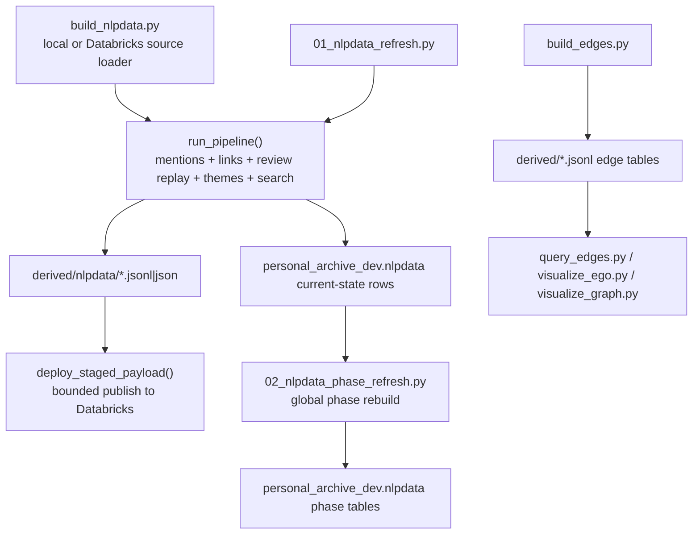

## Data Families

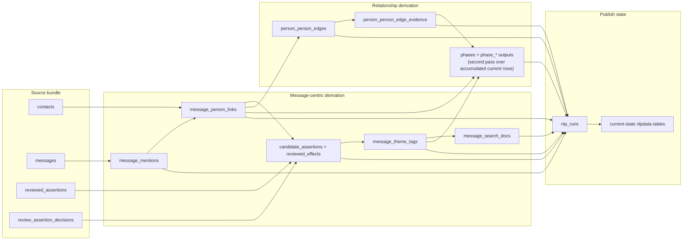

## 1. Source Loading

Goal: turn either an export bundle or live Databricks tables into one normalized `SourceBundle`.

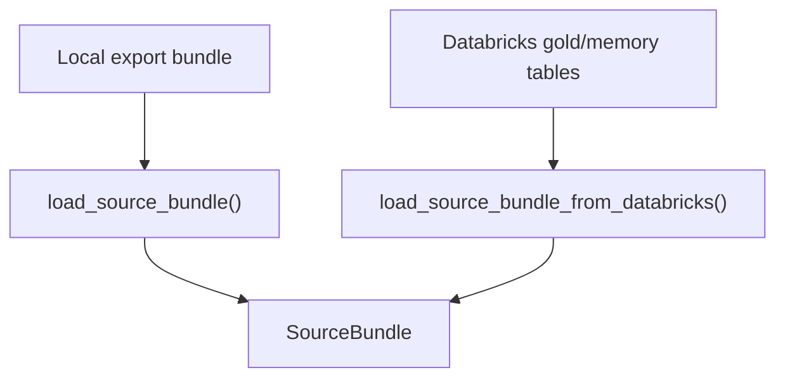

### What actually happens

- Local mode reads:
  - `contacts.jsonl`
  - `messages.jsonl`
  - optional `reviewed_assertions.jsonl`
  - optional `review_assertion_decisions.jsonl`
- Databricks mode reads:
  - canonical people from `gold.persons`
  - message-like interactions from `gold.interactions`
  - optional reviewed feedback from `memory.reviewed_assertions` and `memory.review_assertion_decisions`
- Contacts are normalized into a compact person shape:
  - `person_id`
  - display name
  - emails
  - phones
  - photo URL
  - effective entity type
- Messages are normalized into a compact interaction shape:
  - message id
  - sender
  - recipients
  - subject
  - body
  - timestamp
  - interaction type
- Reviewed assertions are scoped to the current message set, plus pair-scoped relationship assertions that reference relevant messages.

## 2. Mention Extraction

Goal: turn message text into candidate spans with provenance.

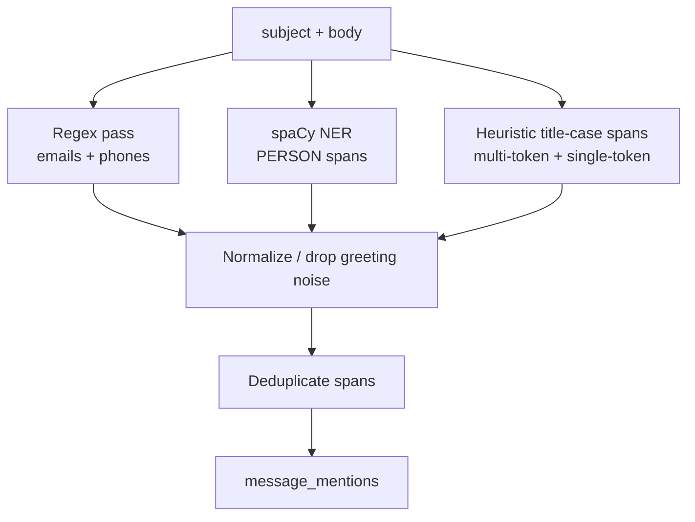

### What actually happens

- The pipeline combines `subject` and `body` into one extraction surface.
- It extracts:
  - emails via regex
  - phones via regex
  - `PERSON` spans via spaCy
  - title-cased heuristic person candidates when the NER model misses them
- Greeting/noise spans like `Hello`, `Hi`, or other low-value tokens are stripped or dropped.
- Multi-token person spans are preferred over nested single-token spans.
- The output is a deduplicated set of `InteractionMention` rows per message, each with:
  - source type
  - span offsets
  - confidence
  - stable mention id

## 3. Person Linking

Goal: resolve message participants and text mentions to canonical people.

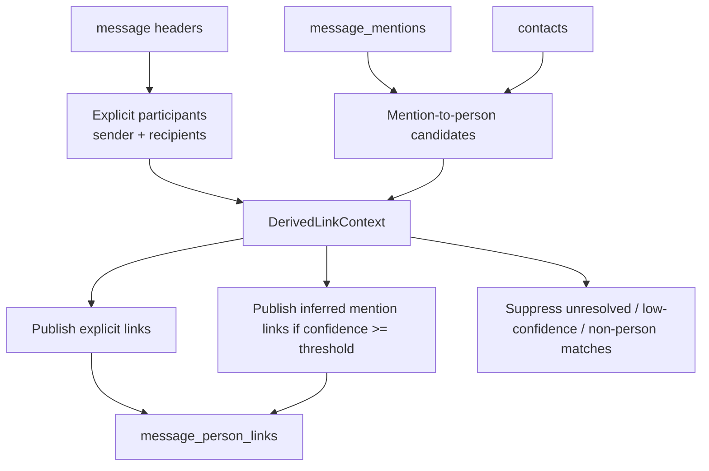

### What actually happens

- Header-level resolution identifies explicit participants from sender and recipient emails.
- Mention-level resolution uses the canonical person set and link scoring from the linking module.
- Explicit participants bias mention resolution so the linker prefers people already on the message.
- `derive_person_links()` emits:
  - explicit sender links
  - explicit recipient links
  - inferred `mentioned` links when the best candidate clears the minimum threshold and is a `person`
- Everything else becomes suppression or unresolved quality metrics rather than published links.

## 4. Candidate Assertion Generation

Goal: create reviewable, pre-canonical assertions when the pipeline sees a risky or ambiguous situation.

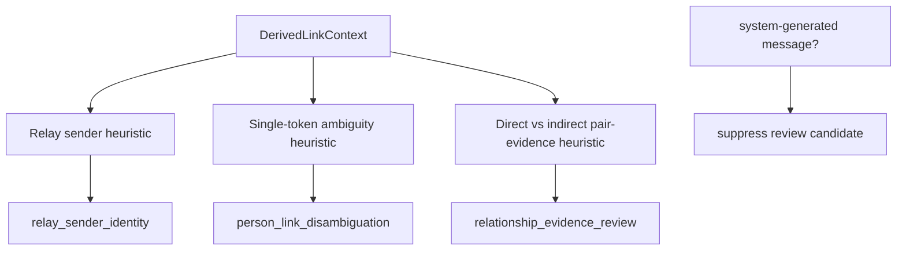

### What actually happens

- The pipeline suppresses review candidates for system-generated messages.
- It emits `relay_sender_identity` when:
  - sender looks relay-like
  - sender is unresolved
  - there is exactly one strong supporting inferred person link
- It emits `person_link_disambiguation` when:
  - a single-token person mention has multiple plausible people
  - there is no clear winner
  - the ambiguity is considered worth asking a human
- It emits `relationship_evidence_review` when the same pair has both:
  - direct evidence from explicit co-participation
  - indirect evidence from mention-based inference
- The output is still non-canonical. These are review prompts, not accepted facts.

## 5. Reviewed Feedback Replay

Goal: let prior human review change what this run publishes.

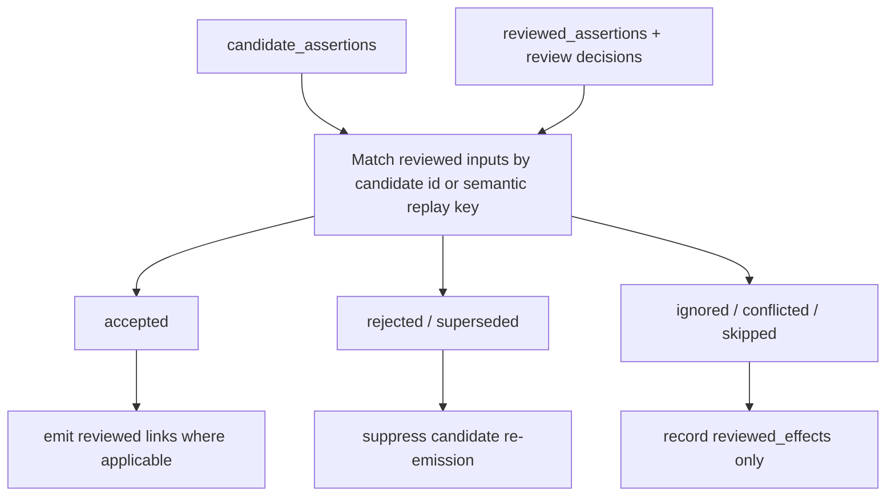

### What actually happens

- Reviewed rows from `graph-data` are normalized into one replay stream.
- Each reviewed item is matched back to regenerated candidates by:
  - exact candidate id, or
  - semantic replay key for rerun stability
- Accepted decisions can materialize new `reviewed` person-message links, especially for:
  - relay sender identity
  - person disambiguation
- Rejected or superseded decisions suppress those candidates from reappearing in the queue.
- Every replay decision produces a `reviewed_effects` audit row so the run records what human feedback changed.

## 6. Theme Tagging

Goal: derive a small deterministic topic layer for non-system messages.

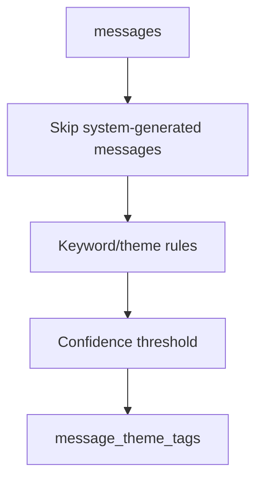

### What actually happens

- Messages from obvious notification/system senders are skipped.
- Rule-based theme matching looks for curated keywords across subject and body.
- Only tags that cross the minimum confidence threshold are emitted.
- Theme outputs are deterministic and intentionally narrow rather than LLM-generated.

## 7. Search Document Projection

Goal: compress message, link, and theme outputs into a search-friendly row.

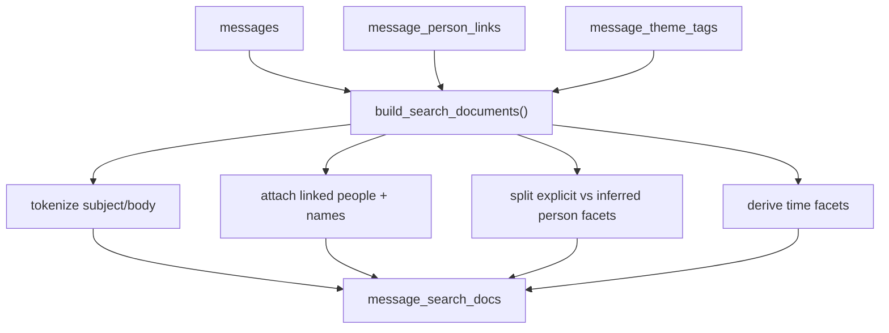

### What actually happens

- System-generated messages are dropped from the search surface.
- Messages with no surviving links and no surviving themes are suppressed as empty search docs.
- The projection stores:
  - tokenized subject terms
  - tokenized body terms
  - linked person ids and names
  - explicit vs inferred person facets
  - theme labels
  - time facets like year and year-month
- The pipeline also flags messages where all derivation remained unresolved.

## 8. Person-Person Edge Projection

Goal: turn person-message links into pairwise relationship evidence.

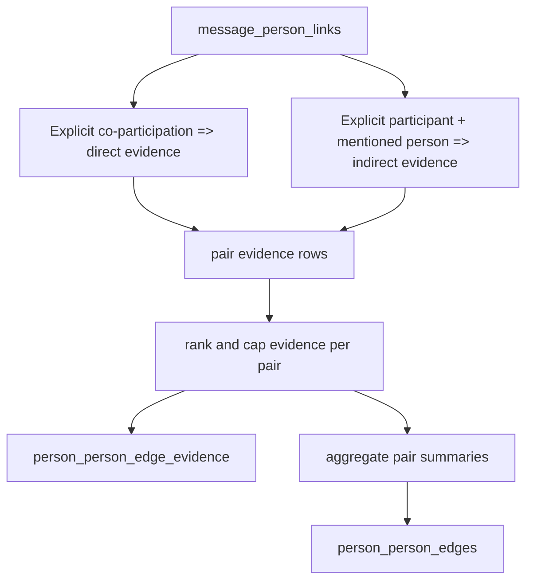

### What actually happens

- Two explicit people on the same message create direct participation evidence.
- An explicit participant plus an inferred mention of someone else creates mention-based pair evidence.
- Evidence rows are deduplicated, ranked, and capped per pair.
- Pair summaries publish:
  - pair id
  - strongest relationship signal
  - direct evidence count
  - indirect evidence count
  - strongest evidence ref

## 9. Phase Segmentation and Temporal Outputs

Goal: turn the accumulated message stream into bounded temporal phases with diagnostics.

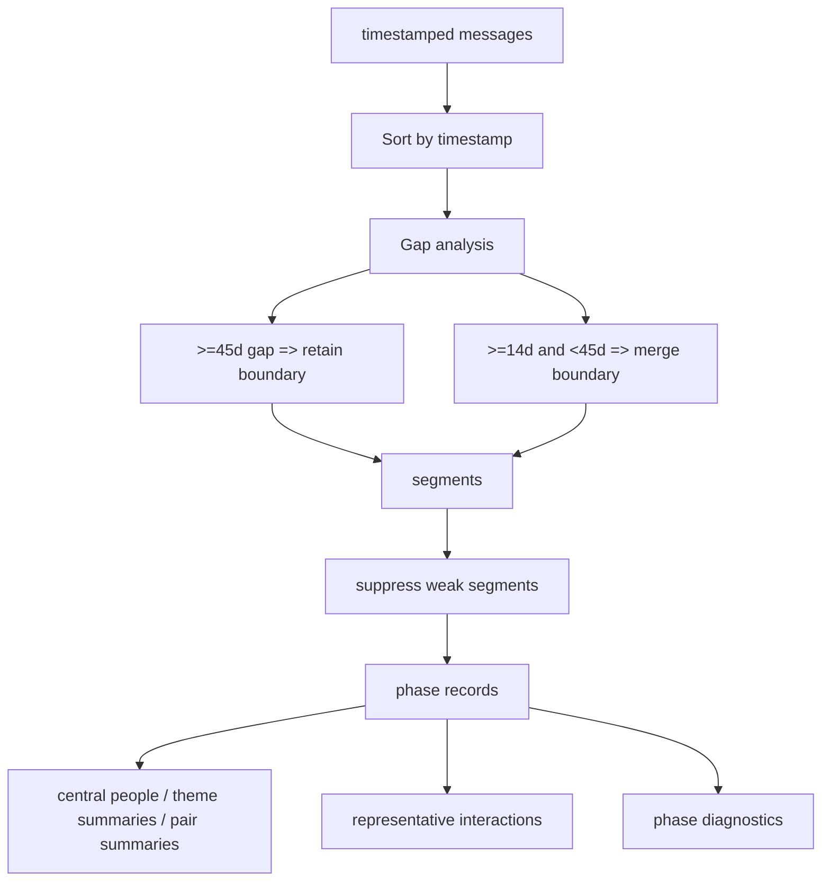

### What actually happens

- Phase analysis now runs after the batch-oriented `nlpdata` writes complete.
- It reads the accumulated current-state message, link, theme, and pair-evidence
  rows, then rebuilds all phase tables in one global pass.
- Only timestamped messages participate in phases.
- Messages are sorted chronologically and split on large gaps.
- Current defaults:
  - `>= 45` days keeps a boundary
  - `>= 14` and `< 45` days records a merged boundary but does not split
- Tiny segments are suppressed instead of published as weak phases.
- Published phase outputs include:
  - `phases`
  - `phase_central_people`
  - `phase_theme_summaries`
  - `phase_pair_summaries`
  - `phase_pair_evidence`
  - `phase_representative_interactions`
  - `phase_diagnostics`

## 10. Run Metadata and Quality Metrics

Goal: record not just rows emitted, but what got suppressed and whether the run was healthy.

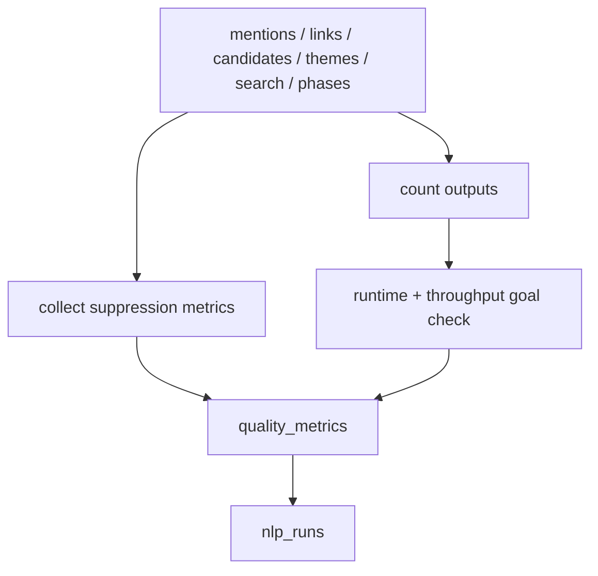

### What actually happens

- The pipeline records counts for every emitted table.
- It also records suppression and diagnostic counters from each stage.
- Runtime is checked against a throughput target rather than just absolute duration.
- A single `RefreshRun` row becomes the run-level audit record for the whole derivation.

## 11. Local Build Surface: `build_nlpdata.py`

Goal: run the full derivation locally or against live Databricks data, then write staged artifacts.

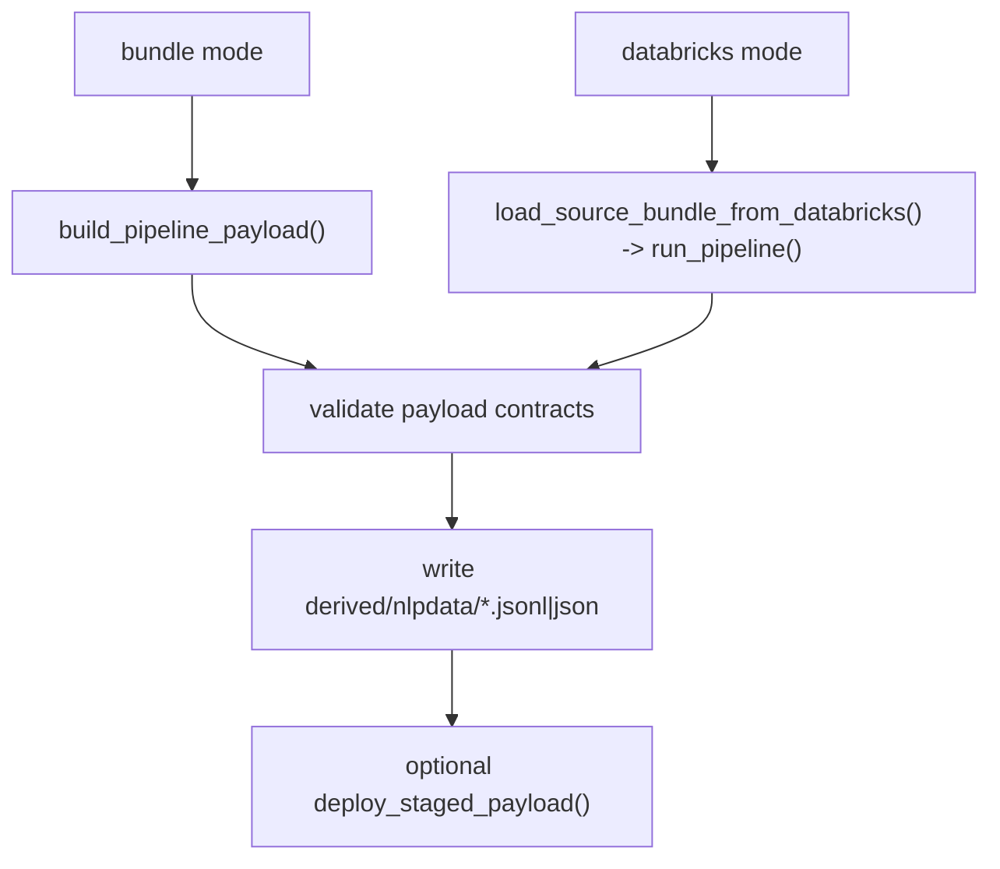

### What actually happens

- Bundle mode is the local deterministic path over exported files.
- Databricks mode pulls live source data, runs the same in-memory pipeline, then writes local staged artifacts.
- The payload is contract-validated before writing.
- `candidate_assertions_summary` is written as `.json`; all other artifacts are `.jsonl`.
- Optional `--deploy` publishes those staged files immediately after building them.

## 12. Databricks Notebook Surface: `01_nlpdata_refresh.py`

Goal: run the batch-oriented derivation inside Databricks and publish directly.

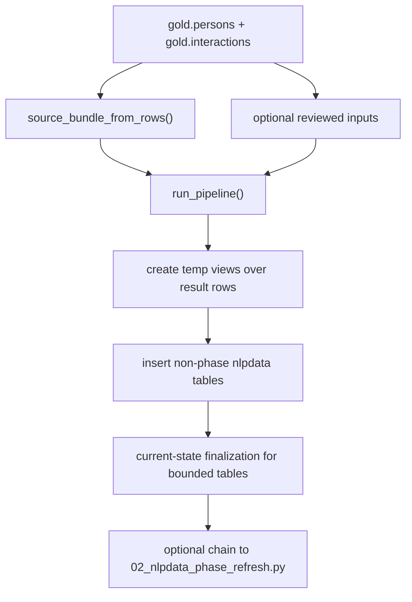

### What actually happens

- The notebook reconstructs the in-memory source bundle from Spark SQL rows.
- It runs the same `run_pipeline()` logic as the CLI path, but defers phase
  outputs for bounded refresh windows.
- It creates temp views for each result table, including the singleton `nlp_runs` row.
- For candidate assertions, it first deletes matching existing candidate ids to avoid rerun duplication.
- For current-state tables, it deactivates prior rows for the same identity set and then activates the staged rows for the new run.
- Unbounded refreshes chain into `02_nlpdata_phase_refresh.py` after the non-phase writes complete.

## 13. Databricks Notebook Surface: `02_nlpdata_phase_refresh.py`

Goal: rebuild `phases` and `phase_*` tables after batch accumulation.

- Loads the full eligible interaction stream from `gold.interactions`.
- Loads current `message_person_links`, `message_theme_tags`, and
  `person_person_edges` from `nlpdata`.
- Deduplicates `person_person_edge_evidence` against the current pair set.
- Runs the global phase refresh pass.
- Deactivates prior current phase rows by generation scope, then inserts the new
  phase rows.

## 14. Publish / Deploy Surface

Goal: stage local artifacts to DBFS and apply bounded publish semantics safely.

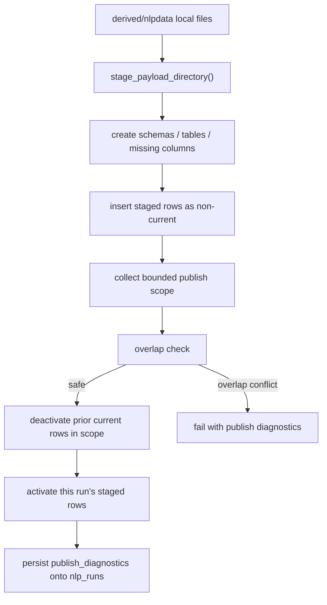

### What actually happens

- Every artifact is uploaded to a remote staged directory first.
- The deploy path creates missing schemas/tables and adds missing columns to match the current contract.
- Current-state tables are inserted as `is_current = false` first.
- The deploy path computes bounded scope:
  - affected messages
  - affected identities
  - affected tables
- If the new scope overlaps a currently active unrelated scope, the publish fails fast instead of corrupting current-state rows.
- Safe publishes then:
  - deactivate prior current rows in scope
  - activate the staged rows for this run
- Diagnostics are written back to `nlp_runs.publish_diagnostics`.

## 15. Local Edge Analysis Path

Goal: provide a simpler, non-`nlpdata` graph-analysis surface over export bundles.

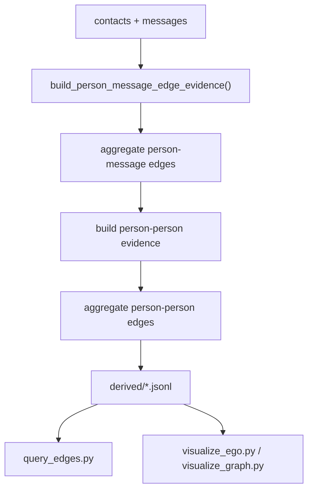

### What actually happens

- `build_edges.py` is the lighter-weight local graph path.
- It derives:
  - person-message evidence
  - aggregated person-message edges
  - person-person evidence
  - aggregated person-person edges
- `query_edges.py` runs preset DuckDB queries over those JSONL tables.
- `visualize_ego.py` and `visualize_graph.py` render HTML network views on top of the derived edge tables.

## Quick Reading Guide

If you want to understand one specific behavior quickly:

- Mention extraction and ambiguity:
  - `mentions.py`
  - `person_links.py`
- Candidate review queue and replay:
  - `person_links.py`
- Search surface:
  - `themes.py`
  - `search_docs.py`
- Temporal segmentation:
  - `pipeline.py`
- Publish semantics:
  - `deploy.py`
  - `01_nlpdata_refresh.py`
- Local graph exploration path:
  - `build_edges.py`
  - `edges/person_message.py`
  - `edges/person_person.py`
